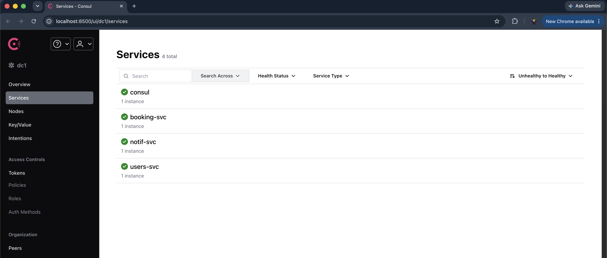
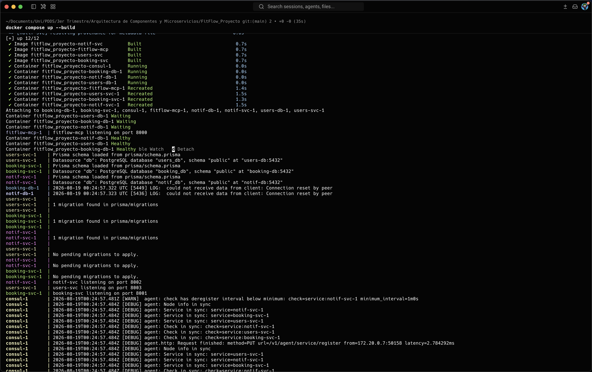
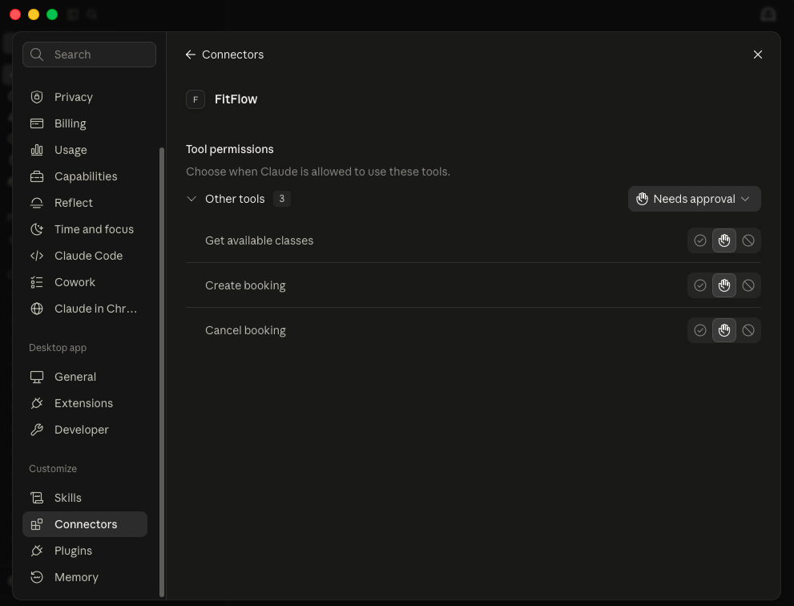
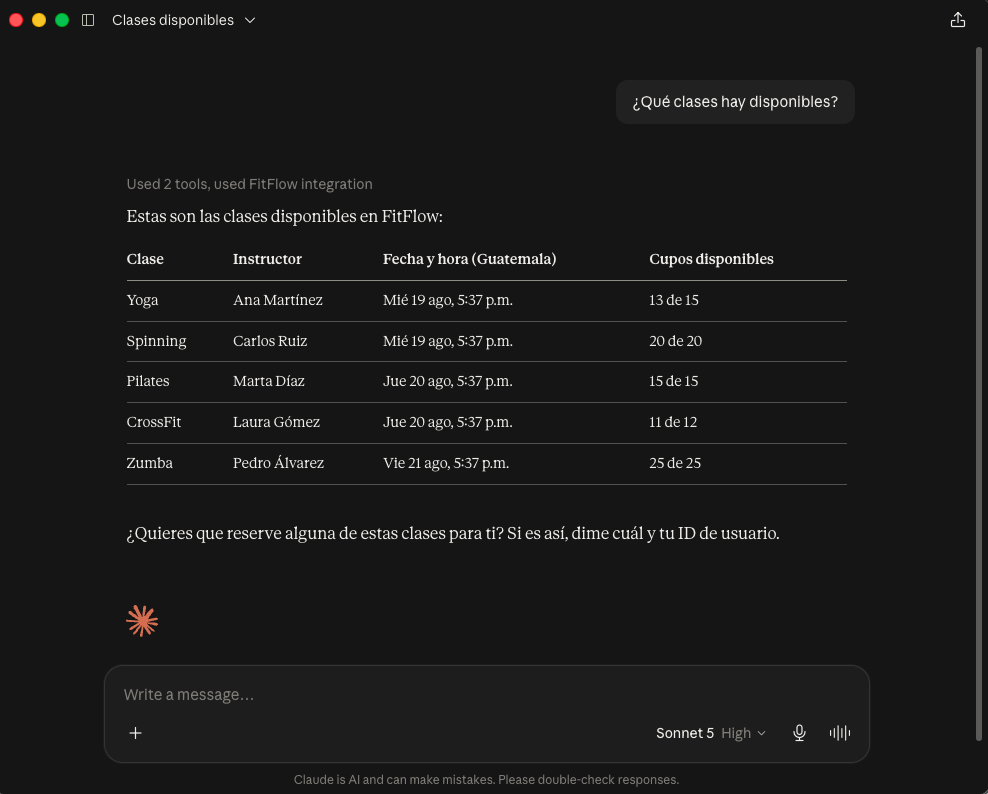
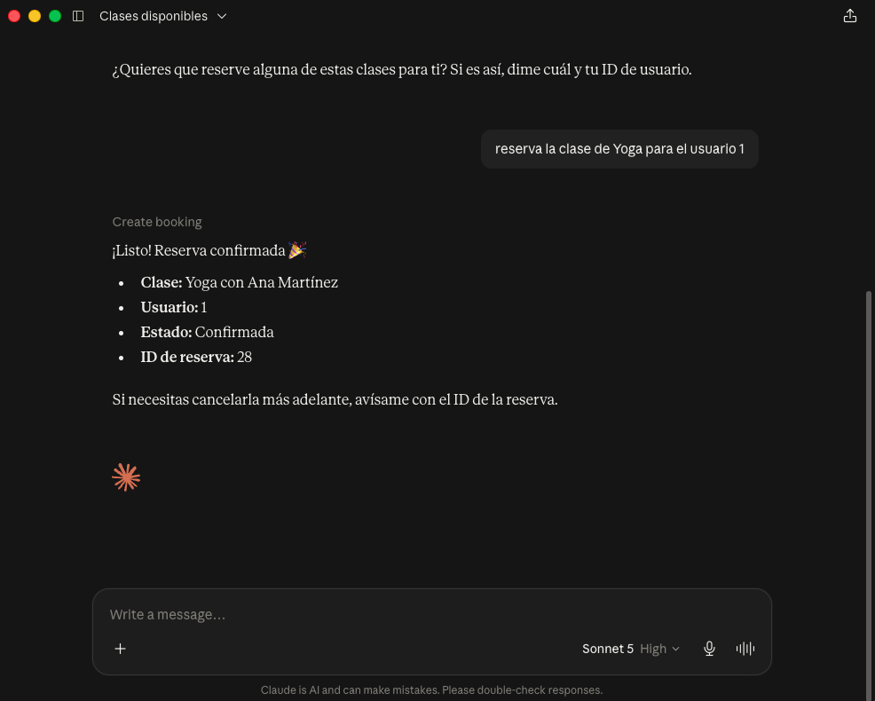

# FitFlow

FitFlow es una plataforma de reservas de clases de gimnasio, pensada como ejercicio de
arquitectura de microservicios. El sistema está compuesto por tres servicios independientes
(usuarios, reservas y notificaciones), cada uno con su propia base de datos, que se registran
solos en un Service Registry (Consul) para poder encontrarse entre sí sin URLs
hardcodeadas. Además hay un servidor MCP que le permite a un agente de IA (Claude Desktop)
interactuar con el sistema usando lenguaje natural.

Por ahora está implementado: los tres microservicios corriendo con Docker Compose, cada uno
con su propia base Postgres, autenticación con JWT, registro y descubrimiento dinámico con
Consul, y el servidor MCP con tres herramientas (listar clases, crear reserva, cancelar
reserva). Cosas como resiliencia ante fallos (circuit breaker, retries), logs estructurados
con correlation-id, rotación de secretos documentada y una capa de agentes A2A quedan como
trabajo futuro.

## Arquitectura

```
                         ┌──────────────────────────┐
                         │        Consul :8500       │
                         │   (service registry +     │
                         │      health checks)        │
                         └───────────┬───────────────┘
                     registro │      │      │ registro
                 ┌────────────┘      │      └────────────┐
                 │                   │ registro           │
                 ▼                   ▼                    ▼
        ┌─────────────────┐ ┌─────────────────┐ ┌──────────────────┐
        │   users-svc      │ │  booking-svc     │ │   notif-svc       │
        │   :8003          │ │  :8001           │ │   :8002           │
        │                  │ │                  │ │                   │
        │  users-db (PG)   │ │ booking-db (PG)  │ │  notif-db (PG)    │
        └─────────────────┘ └────────┬─────────┘ └─────────▲─────────┘
                                       │  descubre notif-svc  │
                                       │  vía Consul y llama   │
                                       └───────────────────────┘

                         ┌──────────────────────────┐
                         │      fitflow-mcp :8000     │
                         │  tools: get_available_     │
                         │  classes, create_booking,  │
                         │  cancel_booking             │
                         │  (descubre booking-svc      │
                         │   vía Consul)                │
                         └───────────┬───────────────┘
                                     │ protocolo MCP (Streamable HTTP)
                                     ▼
                         ┌──────────────────────────┐
                         │      Claude Desktop        │
                         │      (cliente MCP)          │
                         └──────────────────────────┘
```

Cada servicio es dueño exclusivo de sus datos: ningún servicio le pega directo a la base de
otro. Si `booking-svc` necesita avisarle algo a `notif-svc`, primero le pregunta a Consul
dónde está (nunca usa una IP fija), y le pega por HTTP a su API.

## Servicios y puertos

| Servicio      | Puerto | Qué hace                                    |
|---------------|--------|----------------------------------------------|
| users-svc     | 8003   | Registro y autenticación de usuarios (JWT)   |
| booking-svc   | 8001   | Gestión de reservas de clases                |
| notif-svc     | 8002   | Envío de notificaciones (por ahora, un log)  |
| fitflow-mcp   | 8000   | Expone FitFlow a agentes de IA vía MCP       |
| consul        | 8500   | Descubrimiento y registro de servicios       |

## Cómo correrlo

```bash
git clone <url-del-repo>
cd FitFlow_Proyecto
```

Cada servicio tiene su propio archivo de variables de entorno. Hay que copiarlo y completarlo
en los cuatro:

```bash
cp users-svc/.env.example users-svc/.env
cp booking-svc/.env.example booking-svc/.env
cp notif-svc/.env.example notif-svc/.env
cp fitflow-mcp/.env.example fitflow-mcp/.env
```

Para `JWT_SECRET` hay que generar un valor random:

```bash
openssl rand -hex 32
```

Ese mismo valor va en `JWT_SECRET` en `users-svc/.env`, `booking-svc/.env` y
`fitflow-mcp/.env` — los tres tienen que compartir el secreto porque `users-svc` firma los
tokens y los otros dos los validan/generan. Los passwords de Postgres pueden ser cualquier
string, cada servicio usa el suyo.

Con eso listo:

```bash
docker compose up --build
```

Esto levanta 8 contenedores: Consul, las tres bases Postgres, y los cuatro servicios de la
aplicación. Cuando todo esté arriba:

```bash
curl http://localhost:8003/healthz   # {"status":"ok"}
curl http://localhost:8001/healthz   # {"status":"ok"}
curl http://localhost:8002/healthz   # {"status":"ok"}
```

Y en `http://localhost:8500` se puede ver la UI de Consul con `users-svc`, `booking-svc` y
`notif-svc` en verde (healthy).

## Probar los endpoints

Registrar un usuario y hacer login:

```bash
curl -X POST http://localhost:8003/users/register \
  -H "Content-Type: application/json" \
  -d '{"email":"demo@fitflow.test","password":"secret123","name":"Demo User"}'

TOKEN=$(curl -s -X POST http://localhost:8003/users/login \
  -H "Content-Type: application/json" \
  -d '{"email":"demo@fitflow.test","password":"secret123"}' \
  | node -pe 'JSON.parse(require("fs").readFileSync(0)).token')
```

Ver las clases disponibles (se siembran solas al arrancar `booking-svc`):

```bash
curl http://localhost:8001/classes
```

Crear una reserva (requiere el token del login):

```bash
curl -X POST http://localhost:8001/bookings \
  -H "Content-Type: application/json" \
  -H "Authorization: Bearer $TOKEN" \
  -d '{"classId":1}'
```

Cancelar esa reserva:

```bash
curl -X DELETE http://localhost:8001/bookings/1 -H "Authorization: Bearer $TOKEN"
```

Ver el historial de notificaciones del usuario (se genera sola cuando se crea una reserva):

```bash
curl http://localhost:8002/notifications/user/1
```

## Conectar Claude Desktop a fitflow-mcp

`fitflow-mcp` corre dentro de Docker Compose y queda expuesto en `http://localhost:8000/mcp`
usando el transporte Streamable HTTP de MCP, en HTTP plano (sin HTTPS, porque es un servidor
local de desarrollo). La opción de "Add custom connector" de Claude Desktop exige que la URL
sea `https://`, así que para un servidor local en HTTP hay que usar `mcp-remote`, un puente
que corre local y traduce entre lo que Claude Desktop espera y nuestro servidor HTTP. No hace
falta instalarlo a mano, `npx` lo descarga solo la primera vez.

1. Abrir el archivo de configuración de Claude Desktop:
   - macOS: `~/Library/Application Support/Claude/claude_desktop_config.json`
   - Windows: `%APPDATA%\Claude\claude_desktop_config.json`
2. Agregar (o crear) la clave `mcpServers` con esta entrada:
   ```json
   {
     "mcpServers": {
       "FitFlow": {
         "command": "npx",
         "args": ["-y", "mcp-remote", "http://localhost:8000/mcp", "--allow-http"]
       }
     }
   }
   ```
   Si el archivo ya tiene otras claves, esta se agrega al mismo nivel, sin borrar nada de lo
   que ya había.
3. Cerrar Claude Desktop por completo y volver a abrirlo para que cargue la nueva configuración.
4. En un chat nuevo, escribir algo como *"¿qué clases hay disponibles?"* — Claude va a usar
   la herramienta `get_available_classes`, que a su vez descubre `booking-svc` vía Consul y le
   pide la lista real de clases.
5. Para reservar, algo como *"reserva la clase de yoga para el usuario 1"* — Claude usa
   `create_booking`, que crea un JWT válido internamente y llama a `booking-svc` para crear la
   reserva de verdad en la base de datos.

## Capturas


*Consul (`http://localhost:8500`) con `users-svc`, `booking-svc` y `notif-svc` registrados y
saludables.*


*Los 8 contenedores levantando con `docker compose up --build`.*


*El conector personalizado apuntando a `http://localhost:8000/mcp` en Claude Desktop.*


*Claude respondiendo "¿qué clases hay disponibles?" usando la herramienta
`get_available_classes`.*


*Claude creando una reserva real a través de `create_booking`.*
